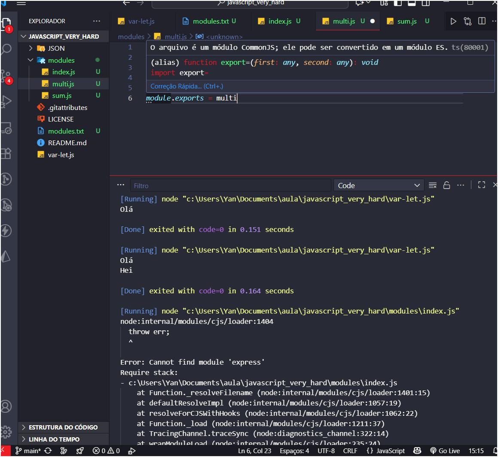
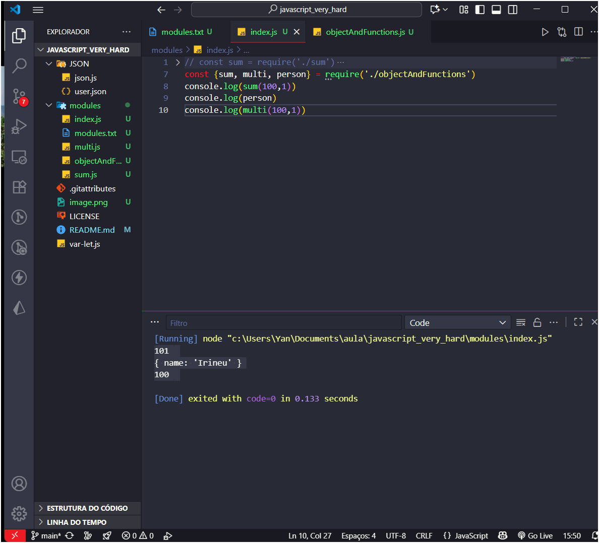

# javascript_very_hard

Javascript Avançado - Anotações e estudos excertos do curso full stack club

# Conteúdo 

Introdução ao JS Avançado

Json

API, API REST E API RESTFUL

Var x Let x Const

Módulos no Node

Entendendo o this

Lidando com erros - Try & Catch

Promises e Async Await

Classes

## Async/Await

JSON - Javascript Object Notation

- Padrão de troca e armazenamento de informações 
- Padão lógico simples 
- Leve para ser enviado e recebido 
- Simples e fácil de entender
- Derivado do Js
- Utiliza o formato chave / valor

## API REST/ RESTFULL
- APLICATION PROGRAMMING INTERFACE -

"Basicamente, o funcionamento dessas aplicações baseava-se em fornecer um pontoo de aceso entre a aplicação e seu cliente, seja ele um usuário ou uma outra aplicação"

- Trata-se  de um conjunto de rotinas e padrões estabelecidos e documentados por uma aplicação X, para que outras aplicações consigam utilizar as funcionalidadess dessa aplicação sem precisar conhecer detalhes da implementação do software. 

- Permitem uma interoperabilidade entre aplicações e entre usuários comunicaçao entrada x usuario

# REST - Representational State TRansfer
Transferência de estado representacional
 - Consiste em princípios e regras que, quando seguidas, permitem a criação de um projeto com interfaces bem definidas, garantindo a comunicação de aplicações
  ser restfull é cumprir padrões REST

    - CLIENTE - SERVIDOR  ( aplicações separadas)
    - sem estado ( no state ) - requisições feitas de modo independente, cada requisição executa uma ação 
    - respostas auto-descritiva
    -> quando fala-se que utilizou rest api - significa uzar uma api para acessar aplicações back end seguindo os padrões rest 

    
    é importante sempre ver o que a ide comunica, pode-se assim obter o mesmo resultado/ solução problema com outra lógica 

    

    # THIS AND ESCOPO 
 
  This no js faz referencia: 
  node -> module.exports
  web -> window

 ## Escopo
 -> Global: quando começamos a escrever nossa aplicação
      faz referência ao objeto global = objeto window 
      no navegador ou no node.js
-> Local: dentro de funções 

⚠️ Diferença em funções normais vs arrow functions
- Função normal → this depende de quem chama.
- Arrow function → this é léxico (pega do escopo onde foi criada).
